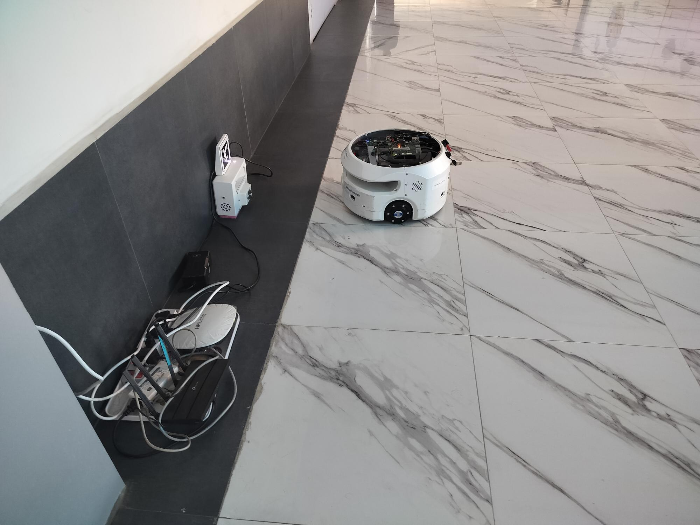

# E-Con Docking System (ROS 2)

This repository contains a complete ROS 2 package and Yocto-enabled embedded build flow for autonomous corridor docking using Nav2, ArUco marker detection, and battery-aware mode switching.

## 📁 Repository Structure

```
GITHUB_ECON_DOCKING/
├── README.md
├── Technical_Manual.md
├── DEMO_Videos/
└── packages_ros2/
    ├── econ_docking/
    │   ├── econ-docking_1.0.bb
    │   └── files/econ_docking/
    │       ├── CMakeLists.txt
    │       ├── package.xml
    │       ├── config/
    │       ├── launch/econ_aruco_docking.launch.py
    │       └── src/
    │           ├── aruco_marker_detector.cpp
    │           ├── battery_monitor_and_docking.cpp
    │           ├── navigate_to_charging_dock_no_nav2.cpp
    │           └── ...
    └── econlidar/
        ├── econlidar_1.0.bb
        └── files/econlidar/
            ├── CMakeLists.txt
            ├── package.xml
            ├── launch/battery_waypoint_docking_launch.py
            └── src/battery_monitor_and_navigate_docking.cpp
```

## 🧭 Overview
E-Con Corridor Docking provides:
- Low-battery waypoint navigation and spawn-goal behavior
- Battery manager that switches systemd services between Nav and Dock
- ArUco-based docking approach and docking control service
- Automatic charge/dock/undock and resume navigation
- Yocto build support for embedded deployment

## 🖼️ Screenshots & Demo
### Docking Demo Image


### Video
- ▶️ [Docking Demo Video](DEMO_Videos/Docking_demo_rover_video.mp4)

## 🧩 System Requirements
- Ubuntu 22.04
- ROS 2 Humble
- Nav2
- (if needed) Yocto build environment for embedded image generation

## 📦 Dependencies Installation
### 1) Install ROS 2 Humble
```bash
sudo apt update
sudo apt install ros-humble-desktop
```

### 2) Install Navigation2
```bash
sudo apt update
sudo apt install ros-humble-navigation2
```

### 3) Install workspace dependencies (run in your ROS 2 workspace root)
```bash
cd <your_ros2_workspace>
source /opt/ros/humble/setup.bash
rosdep update
rosdep install --from-paths src --ignore-src -r -y
```

## 🚀 Quick Start
### Build package
```bash
cd <your_ros2_workspace>
colcon build --packages-select econ_docking econlidar
source install/setup.bash
```

### Run docking (manual)
```bash
ros2 launch econ_docking econ_aruco_docking.launch.py
```

## 🔗 Node Summary (Detailed docs)
See [Technical_Manual.md](Technical_Manual.md) for complete node and topic summary, parameters, and service details.

## 🧭 Node and Topic Overview
- `battery_monitor_and_navigate_docking`: publishes `/reached_spawn`, launches waypoint goals
- `battery_monitor_and_docking`: manages service transitions, subscribes `/battery_info`, `/reached_spawn`, `/docking_charged`
- `aruco_marker_detector`: publishes marker detection and offset
- `navigate_to_charging_dock_no_nav2`: generates `cmd_vel`, publishes `/docking_charged`

## 📌 Notes
- Service names used by code: `econ-corridorrun_nav.service`, `econ-corridorrun_docking.service` (and optional `e-condocking.service` wrapper)
- Configure thresholds and marker ID via launch parameters and config YAML
